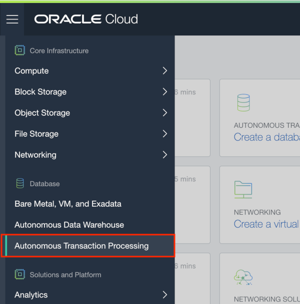
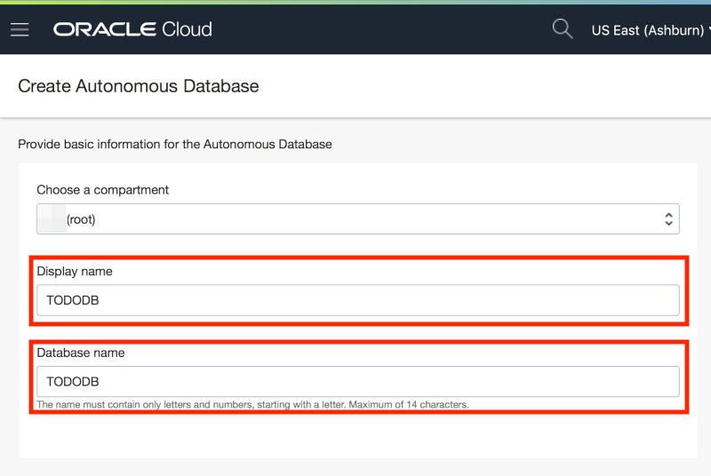
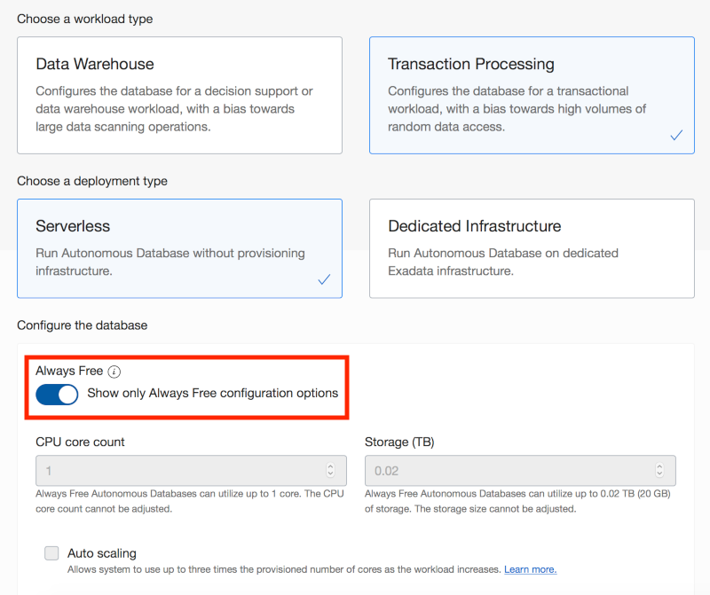
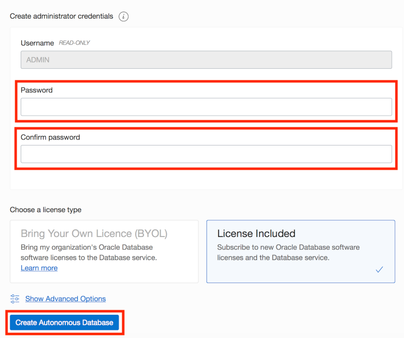

# Module 1: Create an ATP Instance

In this module, you will create an Autonomous Transaction Processing (ATP) instance. The database will be used to store the data related to the todo tracking application.

## Objectives

* Sign-in to the Oracle Public Cloud
* Create an ATP database

## Required Artifacts

* Oracle Cloud account credentials - You may use your own account, a trial account, or a training account provided by an Oracle instructor.

## Parts

### **Part 1**: Sign in to the Oracle Cloud Infrastructure console

In this part, you will sign into your Oracle Cloud account so that you can work with various services using a GUI.

1. Go to cloud.oracle.com, click **Sign In** to sign in with your Oracle Cloud account.

   

2. Enter your **Cloud Account Name** and click **Next**.

   

3. Enter your **User Name** and **Password**, then click **Sign In**.

   

   Once you've successfully authenticated, you'll be redirected to the Oracle Cloud Infrastructure dashboard where you can start working with various cloud services.

### **Part 2**: Create an ATP instance

In this part, you will create an instance of the ATP database service for the todo tracking application.

1. Open the services menu by clicking the navigation menu icon in the upper left-hand corner, then select Autonomous Transaction Processing.

   

2. Click **Create Autonomous Database**.

   

3. Enter the following details and click **Create Autonomous Database**.

   | Property | Value |
   | --- | --- |
   | Display name | **TODODB** |
   | Database name | **TODODB** |
   | Password | **`SecretPassw0rd`** |
   | Confirm password | **`SecretPassw0rd`** |

   
   
   

   After clicking **Create Autonomous Database**, you will be redirected to the Autonomous Database Details page for the new instance. Continue to the next part when the status changes from:
   
    

   to:
   
   

## Summary

This completes Module 1. At this point, you know how to log into your cloud account and create an ATP instance. As you have seen, it takes only minutes to create an autonomous database that can instantly scale to meet the demands of mission critical applications. [Click here to navigate to Module 2](2-create-a-database-user-with-soda-privileges.md).