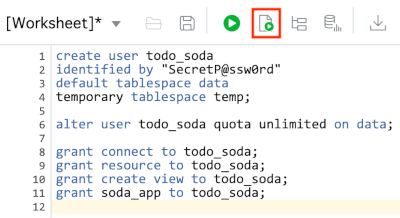

# Lab 1: Create a DB user with SODA privileges

## Introduction

When you create an Autonomous Transaction Processing (ATP) instance, you are prompted for a password for the ADMIN user. The ADMIN user account should be used for administrative purposes only, not for typical application development. In this lab, you will use the ADMIN account to create a new user for the todo tracking app.

## Objectives

- Sign-in to the Oracle Public Cloud
- Connect to an ATP instance from SQL Developer
- Create a database user with SODA privileges

## Required Artifacts

- Oracle Public Cloud account credentials - You may use your own cloud account, a cloud account that you obtained through a trial, or a training account whose details were given to you by an Oracle instructor.
- ATP instance and ADMIN credentials - This lab assumes that an ATP instance has already been created and that you have the ADMIN password. You may create an ATP instance if needed before continuing, just note the ADMIN password specified when creating the instance.
- SQL Developer - SQL Developer is a free, integrated development environment that simplifies the development and management of Oracle Database in both traditional and Cloud deployments. Download the latest version for your operating system [here](https://www.oracle.com/technetwork/developer-tools/sql-developer/downloads/index.html).

# Create a DB user with SODA privileges

## Steps

### Step 1: Sign in to Oracle Cloud Infrastructure console

In this step, you will sign into your Oracle cloud account so that you can work with various services using a GUI.

- Go to cloud.oracle.com, click **Sign In** to sign in with your Oracle Cloud account.

  

- Enter your **Cloud Account Name** and click **Next**.

  

- Enter your **User Name** and **Password**, then click **Sign In**.

  

  Once you've successfully authenticated, you'll be redirected to the Oracle Cloud Infrastructure dashboard where you can start working with various cloud services.

### Step 2: Download ATP client credentials (wallet)

With Oracle Autonomous Database, data is encrypted both at rest and while communicating with the database. For network encryption to work, clients need to have the correct encryption keys and related connection details. In this step, you'll learn how to access these credentials so that various clients can connect to the database.

- Open the services menu by clicking the "hamburger" icon in the upper left-hand corner, then select **Autonomous Transaction Processing**.

  

- Click the name of the ATP instance you would like to connect to. This will take you to the Database Details page for that instance.

  

- Click the **DB Connection** button to open a popup menu with connection related information.

  

- Click the **Download** button to download your client credentials.

  

- Enter a password for the client credentials, then click **Download**. Note that **the password entered will not be used in this lab** because you will be using auto-login capable clients. 

  

  After clicking **Download**, the client credentials will be downloaded to your machine as a zip file. These files should be treated securely. 

### Step 3: Connect to ATP from SQL Developer

Now that you've downloaded the client credentials for your ATP instance, you can use them to connect to the database from SQL Developer. Be sure to use the latest version of SQL Developer so that you have the latest features for connecting to cloud databases.

- Start SQL Developer and then click the new connection button in the upper left-hand corner.

  

- Use the following details to create the new connection:

    | Property           | Value                                             |
    | ------------------ | ------------------------------------------------- |
    | Name               | **atp.admin** (or any connection name you prefer) |
    | Username           | **admin**                                         |
    | Password           | admin password*                                   |
    | Save Password      | **check** to save the password                    |
    | Connection Type    | **Cloud Wallet**                                  |
    | Configuration File | /path/to/**Wallet_[db_name].zip**                 |
    | Service            | **[db_name]_high**                                |

  \* The admin password was provided when the database was created, not when the client credentials were downloaded.
  
  

  Click the **Test** button to test the connection details. If successful, click **Save** to save the connection for future use.

### Step 4: Create a database user with SODA privileges

Now that you are able to connect to the database as the ADMIN user, you will use that account to create a new user/schema that will be used for the todo app. 

- Click the "plus" sign next to the connection you created in the previous step. This will connect to the database and open a SQL Worksheet.

  

- Enter the following code in the SQL Worksheet:

  ```sql
  create user todo_soda 
  identified by "SecretP@ssw0rd"
  default tablespace data
  temporary tablespace temp;

  alter user todo_soda quota unlimited on data;

  grant connect to todo_soda;
  grant resource to todo_soda;
  grant soda_app to todo_soda;
  ```

  The last line of the code is the most significant with respect to SODA. That line grants the SODA_APP role to the TODO_SODA user, giving that user the necessary privileges to use the SODA APIs.

- To run the code, click the "Run Script" button above the SQL Worksheet.

  

  Look at the Script Output window at the bottom of the SQL Worksheet to ensure the script ran successfully.

### Summary

At this point, you are able to create a secure connection to your ATP instance from SQL Developer as the ADMIN user. You've used that user to create an application user/schema that will be used in subsequent labs to host the todo application data.
