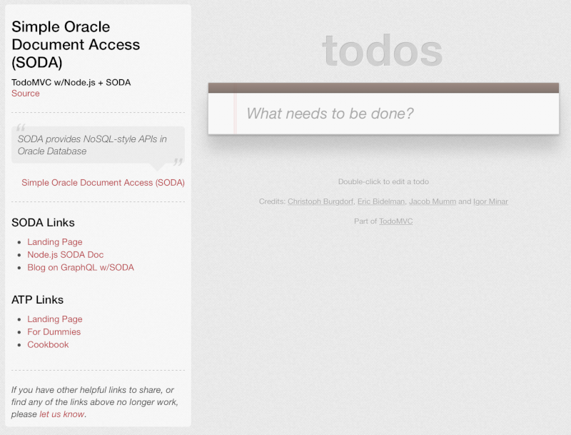

# Lab 2: Clone Git repo and build Docker image

## Introduction

In this lab, you will clone the public GitHub repo that will serve as the starting point for the Node.js app that you will be extending in the next lab. To run the app, you will build a docker image that includes Node.js and various dependencies necessary for the application to run. This configuration will allow you to work on the application code from your host operating system while minimizing any cross platform issues.

## Objectives

- Clone the todo application's Git repo
- Build a docker image to host the application
- Run a docker container based on the image

## Required Artifacts

- Git - The todo application is hosted in GitHub so Git is used to clone the repo. If Git isn't available, you may opt to download the repo from GitHub as a zip file and extract the contents where you wish.
- Docker - Docker is a standard tool for packaging and deploying applications, especially when Continuous Integration and Continuous Deployment strategies are used.

# Clone Git repo and build Docker image

## Steps

### Step 1: Clone Git repo with "starter" app

To allow you to focus on the SODA APIs, you will be cloning a starter application. The application is wired up to provide a REST API to a front-end app, but it is not completely implemented. You will finish building out the app in the next lab.

- Open a command line terminal on your machine and navigate to a directory where you'd like to download the starter app, then run the following command:

  ```
  git clone https://github.com/dmcghan/soda-app.git
  ```
- Once the application has finished downloading, change directories into the **soda-app** directory to see the files included with the app. See the README ([sometimes easier to read online](https://github.com/dmcghan/soda-app)) for information on how the application works. Note the absolute path to the application directory as you'll need that in a subsequent step.

### Step 2: Build Docker image

In this step, you will build a docker image to host the application downloaded in the previous step.

- If not already done, open a terminal in the **soda-app** directory where the Dockerfile is located, then run the following command:

  ```
  docker build -t soda-app-image .
  ```

  That command will create an image with the tag **soda-app-image**. The docker image may take a few minutes to build as there are a fair number of dependencies. While the image is building, take a moment to review the Dockerfile so that you have a better understanding of what's included.

### Step 3: Run Docker image and test sample app

With the Docker image built, you're now ready to run a container based on the image. In this step, you'll start a docker container which maps some ports and directories on your host machine to the docker container. 

- Locate the client credentials zip file that was downloaded in Step 2 of the previous lab. Extract the contents of the zip file to a directory that has the same name as the zip file. Note the absolute path the directory on your machine as you'll need that in a subsequent step.
- Copy and paste the following terminal command into your favorite text editor: 

  ```shell
  docker run -it \
    --name soda-app-container \
    -v [APP_DIR]:/app \
    -v [WALLET_DIR]:/db_credentials \
    -p 3000:3000 \
    soda-app-image:latest
  ```

- In the text editor, replace the `[APP_DIR]` and `[WALLET_DIR]` tokens with the correct values. The `[APP_DIR]` value should be the absolute path to where the starter app was cloned. The `[WALLET_DIR]` value should be the absolute path to where the client credentials were extracted. Here's an example of what the command should look like on a Mac after replacing the tokens:

  ```shell
  docker run -it \
    --name soda-app-container \
    -v /Users/username/Documents/soda-hol/app-start:/app \
    -v /Users/username/Downloads/Wallet_testdb:/db_credentials \
    -p 3000:3000 \
    soda-app-image:latest
  ```
- Copy the modified command from your text editor and run it in a terminal. This will create and run a Docker container named **soda-app-container** based on the **soda-app-image** image created previously. The last lines in the output from the command should look like the following:
  ```shell
  Starting application
  Initializing database module
  Initializing web server module
  Web server listening on localhost:3000
  ```
- Test the image by opening a browser and navigating to **localhost:3000**. If you see the following app, then you're ready to proceed to the next lab.

  

### Summary

At this point, you have the starter application running in a docker container. If you test the app by adding some todos, you'll find that the todos are not saved. This is because the CRUD functionality for the REST API hasn't been added yet. You'll add that logic using the SODA APIs in the next lab.