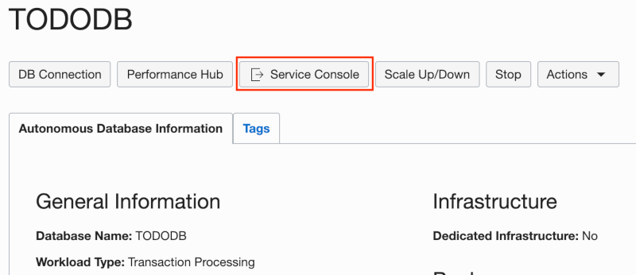

# Module 2: Create a Database User with SODA Privileges

When you create an ATP instance, you are prompted for an ADMIN user password. The ADMIN user account should be used for administrative purposes only, not for typical application development. In this module, you will use the ADMIN account to create a new user for the todo tracking app.

## Objectives

* Connect to an ATP instance from SQL Developer Web
* Create a database user with SODA privileges

## Parts

### **Part 1**: Connect to ATP from SQL Developer Web

As its name implies, SQL Developer Web is a web based version of SQL Developer. It provides a subset of the features available in the desktop product and is the easiest way to connect to and work with an ATP instance programatically. In this part, you will learn how to access SQL Developer Web and log in with the ADMIN account.

1. If not already on the Autonomous Database Details page, navigate there by going to the Autonomous Transaction Processing service and then click the **TODODB** instance name. 

   

2. Click the **Service Console** button. This will open the ATP Service Console in a new browser window.

   

3. Click the **Development** menu option on the left, then click **SQL Developer Web**. This will open SQL Developer Web in a new browser window.

   

4. Log into SQL Developer Web using **admin** as the Username (case insensitive) and **`SecretPassw0rd`** for the Password, then click **Sign in**.

   

   Once authenticated, you should see a GUI similar to SQL Developer that will allow you to work with the ATP instance.

   

### **Part 2**: Create a database user with SODA privileges

Now that you are connected to the database as the ADMIN user, you will use that account to create a new user/schema that will be used for the todo app. 

1. Copy and paste the following code into the **[Worksheet]**:

   ```sql
   create user todo_soda 
   identified by "SecretPassw0rd"
   default tablespace data
   temporary tablespace temp;
 
   alter user todo_soda quota unlimited on data;
 
   grant connect to todo_soda;
   grant resource to todo_soda;
   grant create view to todo_soda;
   grant soda_app to todo_soda;
   ```

   The last line of the code is the most significant with respect to SODA. That line grants the **SODA_APP** role to the **TODO_SODA** user, giving that user the necessary privileges to use the SODA APIs.

2. To run the code, click the "Run Script" button.

   

   Look at the **Script Output** tab at the bottom of the worksheet to ensure the script ran successfully.

   

   If you see an "ORA-01917: user or role 'TODO_SODA' does not exist." error, then you likely pressed the "Run Statement" button to the left of the "Run Script" button. That button only executes the last statement. Click "Run Script" to run all of the statements in the script.

3. Finally, execute the following script as before. This will allow the **TODO_SODA** user to connect to SQL Developer Web as well (you will do this in Module 5):

   ```sql
   begin
 
     ords_admin.enable_schema(
       p_enabled => true,
       p_schema => 'TODO_SODA', -- schema to grant sql dev web access
       p_url_mapping_type => 'BASE_PATH',
       p_url_mapping_pattern => 'todo_soda', -- alias used in the URL for access
       p_auto_rest_auth => true
     );
 
     commit;
     
   end;
   ```
   
   Verify that the script ran successfully by looking at the **Script Output** tab.
 
   

## Summary

This completes Module 2. You now know how to connect to your ATP instance as the ADMIN user with SQL Developer Web and use that account to create new application users/schemas. Normally, you would need to create tables in the new schema using a tool like SQL Developer Web to store the todo data. However, with SODA this isn't required. In Module 4, you'll see how this can be done from the application instead and without any SQL code. But before that, you'll need to get the mid-tier app up and running. [Click here to navigate to Module 3](3-package-the-todo-app-to-run-locally.md).
