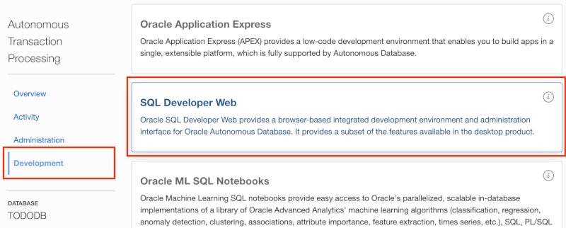
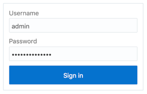

# Module 2: Create a Database User with SODA Privileges

When you create an ATP instance, you are prompted for a password for the ADMIN user. The ADMIN user account should be used for administrative purposes only, not for typical application development. In this module, you will use the ADMIN account to create a new user for the todo tracking app.

## Objectives

- Sign-in to the Oracle Public Cloud
- Connect to an ATP instance from SQL Developer Web
- Create a database user with SODA privileges

## Required Artifacts

- Oracle Public Cloud account credentials - You may use your own cloud account, a cloud account that you obtained through a trial, or a training account provided by an Oracle instructor.

## Parts

### **Part 2**: Connect to ATP from SQL Developer Web

The easiest way to connect to an ATP instance is using SQL Developer Web. In this part, you will learn how to access SQL Developer Web and log in with the ADMIN account.

- Navigate to the Autonomous Transaction Processing page and click the name of the ATP instance you would like to connect to. This will take you to the Database Details page for that instance.

  

- Click the **Service Console** button. This will open the ATP Service Console in a new window.

  

- Click the **Development** option in the menu on the left, then click the **SQL Developer Web** option. This will open SQL Developer Web in a new window.

  

- Log into SQL Developer Web using **admin** as the user name (case insensitive) and the admin password (case sensitive) that was provided when the ATP instance was created, then click **Sign in**.

  

  Once authenticated, you should see a GUI similar to SQL Developer that will allow you to work with the ATP instance.

  

### **Part 4**: Create a database user with SODA privileges

Now that you are connected to the database as the ADMIN user, you will use that account to create a new user/schema that will be used for the todo app. 

- Enter the following code in the **[Worksheet]**:

  ```sql
  create user todo_soda 
  identified by "SecretP@ssw0rd"
  default tablespace data
  temporary tablespace temp;

  alter user todo_soda quota unlimited on data;

  grant connect to todo_soda;
  grant resource to todo_soda;
  grant create view to todo_soda;
  grant soda_app to todo_soda;
  ```

  The last line of the code is the most significant with respect to SODA. That line grants the **SODA_APP** role to the **TODO_SODA** user, giving that user the necessary privileges to use the SODA APIs.

- To run the code, click the "Run Script" button.

  

  Look at the **Script Output** tab at the bottom of the worksheet to ensure the script ran successfully.

  

- Finally, execute the following script as before. This will allow the **TODO_SODA** user to connect to SQL Developer Web as well:
  ```sql
  begin

    ords_admin.enable_schema(
      p_enabled => true,
      p_schema => 'TODO_SODA',
      p_url_mapping_type => 'BASE_PATH',
      p_url_mapping_pattern => 'TODO_SODA',
      p_auto_rest_auth => true
    );

    commit;
    
  end;
  ```
  Verify that the script ran successfully by looking at the **Script Output** tab.

  

## Summary

This completes Module 2. You now know how to connect to your ATP instance from SQL Developer Web as the ADMIN user and create new application users/schemas. [Click here to navigate to Module 3](3-package-the-todo-app-to-run-locally.md).
