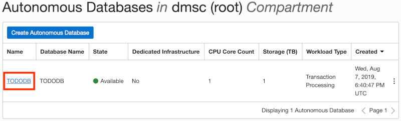
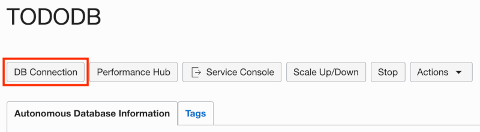
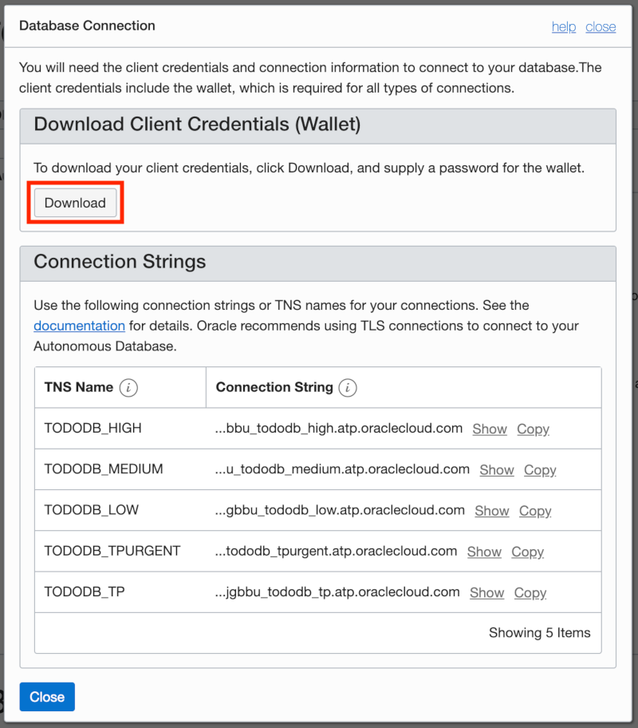
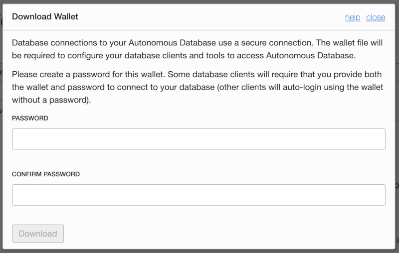
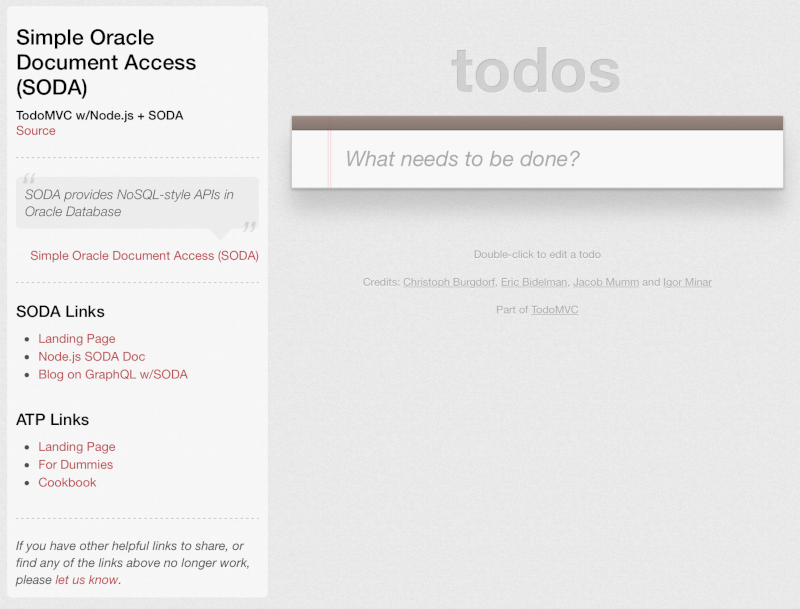

# Module 3: Package the Todo App to Run Locally

In this module, you will clone the public GitHub repo that will serve as the starting point for the Node.js app that you will be extending in the next module. To run the app, you will build a docker image that includes Node.js and various dependencies necessary for the application to run. This configuration will allow you to work on the application code from your host operating system while minimizing any cross platform issues.

## Objectives

* Download client credentials for secure connections
* Clone the todo application's Git repo
* Build a docker image to host the application
* Run a docker container based on the image

## Required Artifacts

- Git - The todo application is hosted in GitHub so Git is used to clone the repo. If Git isn't available, you may opt to download the repo from GitHub as a zip file and extract the contents where you wish.
- Docker - Docker is a standard tool for packaging and deploying applications, especially when Continuous Integration and Continuous Deployment strategies are used. Here's [a link to a Docker cheat sheet](https://www.docker.com/sites/default/files/Docker_CheatSheet_08.09.2016_0.pdf) which includes examples of the most common commands, such as how to list and remove images and containers.

## Parts

### **Part 1**: Download ATP client credentials (wallet)

With Oracle Autonomous Database, data is encrypted both at rest and over the network. For network encryption to work, clients need to have the correct encryption keys and related connection details. In this part, you'll learn how to access and configure these credentials so that various clients can connect to the database.

- Within your cloud account, navigate to the Autonomous Transaction Processing service page and click the name of the ATP instance you would like to connect to. This will take you to the Database Details page for that instance.

  

- Click the **DB Connection** button to open a dialog with connection related information.

  

- Click the **Download** button to download your client credentials.

  

- Enter a password for the client credentials, then click **Download**. Note that **the password entered will not be used in this lab** because you will be using auto-login capable clients. 

  

  After clicking **Download**, the client credentials will be downloaded to your machine as a zip file. These files should be treated securely to prevent unauthorized database access.

- Extract the contents of the zip file to a directory that has the same name as the zip file. Note the absolute path to the client credentials directory on your machine as you'll need that later on when mapping a Docker volume.

- Open the **sqlnet.ora** file in the client credentials directory. Change the **DIRECTORY** value from `"?/network/admin"` to `"/db_credentials"`, then save your changes. In part 4, the `/db_credentials` path will be mapped to the actual location of the client credentials as a Docker volume.

### **Part 2**: Clone Git repo with the "starter" app

To allow you to focus primarily on the SODA APIs, you will be cloning a starter application. The application is wired up to provide a REST API to a front-end app, but it is not 100% complete. You will finish building out the app in the next module.

- Open a command line terminal on your machine and navigate to a directory where you'd like to download the starter app, then run the following command:

  ```
  git clone https://github.com/dmcghan/soda-app.git
  ```
- Once the application has finished downloading, change directories into the **soda-app** directory to see the files included with the app. The README file ([sometimes easier to read online](https://github.com/dmcghan/soda-app)) provides an overview of how the application works. Note the absolute path to the application directory as you'll need that in part 4.

### **Part 3**: Build Docker image

In this part, you will build a docker image to host the application downloaded in the previous part.

- If not already done, open a terminal in the **soda-app** directory where the Dockerfile is located, then run the following command:

  ```
  docker build -t soda-app-image .
  ```

  That command will create an image with the tag **soda-app-image**. The docker image may take a few minutes to build as there are a fair number of dependencies. While the image is building, take a moment to review the Dockerfile so that you have a better understanding of what's included.

  When complete, the final output of the Docker build should look something like the following:

  ```
  > oracledb@4.0.0 install /usr/lib/node_modules/oracledb
  > node package/install.js
  
  oracledb ********************************************************************************
  oracledb ** Node-oracledb 4.0.0 installed for Node.js 10.16.2 (linux, x64)
  oracledb **
  oracledb ** To use node-oracledb:
  oracledb ** - Oracle Client libraries (64-bit) must be configured with ldconfig or LD_LIBRARY_PATH
  oracledb ** - To get libraries, install an Instant Client Basic or Basic Light package from
  oracledb **   https://www.oracle.com/technetwork/topics/linuxx86-64soft-092277.html
  oracledb **
  oracledb ** Installation instructions: https://oracle.github.io/node-oracledb/INSTALL.html
  oracledb ********************************************************************************
  
  + oracledb@4.0.0
  added 1 package in 0.652s
  + todomvc@0.1.1
  added 51 packages from 37 contributors in 3.735s
  v10.16.2
  6.9.0
  Installed
  Removing intermediate container cc93a1a3bdb1
  ---> 3d5a42ac4212
  Step 6/6 : CMD ["pm2-runtime", "/app/process.json"]
  ---> Running in 920b7d297959
  Removing intermediate container 920b7d297959
  ---> a089c2999dc3
  Successfully built a089c2999dc3
  Successfully tagged soda-app-image:latest
  ```

### **Part 4**: Run Docker image and test sample app

With the Docker image built, you're now ready to run a container based on the image. In this part, you'll start a docker container which maps some ports and directories on your host machine to the docker container. 

- Open the **database.js** file in the **config** directory. Replace the `[SERVICE_NAME]` token for the `connectString` property to the connect string that ends with `_tp` in the **tnsnames.ora** file in the client credentials directory. For example, if you database name is "TODODB" then the correct `connectString` value will be `TODODB_tp`.
- Copy and paste the following terminal command into your favorite text editor: 

  ```shell
  docker run -it \
    --name soda-app-container \
    -v [APP_DIR]:/app \
    -v [WALLET_DIR]:/db_credentials \
    -p 3000:3000 \
    soda-app-image:latest
  ```

- In the text editor, replace the `[APP_DIR]` and `[WALLET_DIR]` tokens with the correct values. The `[APP_DIR]` value should be the absolute path to where the starter app was cloned. The `[WALLET_DIR]` value should be the absolute path to where the client credentials were extracted. Here's an example of what the command should look like on a Mac after replacing the tokens:

  ```shell
  docker run -it \
    --name soda-app-container \
    -v /Users/username/Documents/soda-hol/app-start:/app \
    -v /Users/username/Downloads/Wallet_TODODB:/db_credentials \
    -p 3000:3000 \
    soda-app-image:latest
  ```
- Copy the modified command from your text editor and run it in a terminal. This will create and run a Docker container named **soda-app-container** based on the **soda-app-image** image created previously. The last lines in the output from the command should look like the following:
  ```shell
  Starting application
  Initializing database module
  Initializing web server module
  Web server listening on localhost:3000
  ```
- Test the image by opening a browser and navigating to **localhost:3000**. If you see the following app, then you're ready to proceed to the next module.

  

## Summary

This completes Module 3. At this point, you have the starter application running in a docker container. If you test the app by adding some todos, you'll find that the todos are not saved. This is because the CRUD functionality for the REST API hasn't been added yet. You'll add that logic using the SODA APIs in the next module. [Click here to navigate to Module 4](4-use-soda-apis-for-crud-operations.md).