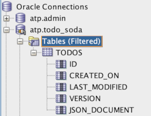

# Lab 3: Update app to use SODA APIs

## Introduction

In this lab, you will extend the Node.js starter application by adding the appropriate SODA API calls and related code. By the end of the lab, all of the basic CRUD functionality to work with todos in the todo app will be complete.

## Objectives

- Use SODA APIs to create a collection to store todos
- Use SODA APIs for CRUD operations related to todos

## Required Artifacts

- NA

# Update app to use SODA APIs

## Steps

### Step 1: Create a collection to store todos

The terminology used with document stores differs a little from what you might be used to in the relational world. For example, rather than tables that store rows, you work with collections that store documents. In this step, you will create a collection to store todo documents.

With node-oracledb (the Oracle Database driver for Node.js), SODA APIs are exposed via a top level object returned from a synchronous method call on a connection object: `connection.getSodaDatabase()`. Once that object is obtained, a collection can be created via the `soda.createCollection()` method.

- Open the **database.js** file in the **util** directory.
- Locate the `initialize` function and replace the comment related to adding SODA code with the appropriate code to create a collection named "todos". [Consult the documentation](https://oracle.github.io/node-oracledb/doc/api.html#-262-creating-soda-collections) for details on creating collections. <br /><br />
  
  Note that the Docker container uses a program to monitor changes you make to the application code. When you update the code and save your changes the app should restart automatically. If the code has an error that prevents the app from starting correctly, then the container may eventually stop running. If this happens, you can restart the container with the following command:

  ```
  docker start -i soda-app-container
  ```
- To validate your change, open SQL Developer and create a new connection for the todo_soda user. See Lab 1 for the steps to create a new connection as well as the password for todo_soda (in the SQL script to create the user). Open the connection to todo_soda and then open the tables node in the database objects tree. If you see a TODOS table then you know you've successfully created the "todos" collection.

  

  As you can see, SODA collections are backed by traditional tables in Oracle. In the next lab, you'll see how you can use those tables along with some new SQL functions to work with the JSON data in different ways.

### Step 2: Add documents to the collection

With the todos collection in place, you can start to build out the CRUD functionality in the API related to todos. In this step, you will add the ability to add todo documents to the todos collection.

- Open the **todos.js** in the **db_apis** directory.
- Locate the `create` function and replace the comment related to adding SODA code with code that does the following:
  * Get a reference to the top level SODA object
  * Get a reference to the todos collection
  * Use a collection method to add the todo document to the todos collection. Use the method that returns the metadata related to the document.
  * Add an `id` property to the todo object that is returned at the end of the function. The value of the property should be equal to the `key` value of the document that was added to the collection. 

### Step 3: Fetch documents from the collection 

### Step 4: Update documents in the collection

### Step 5: Remove documents from the collection
