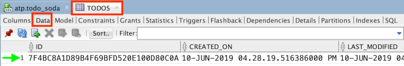

# Lab 3: Update app to use SODA APIs

## Introduction

In this lab, you will extend the Node.js starter application by adding the appropriate SODA API calls and related code. By the end of the lab, all of the basic CRUD functionality to work with todos in the todo app will be complete.

Note that the Docker container created in the previous lab uses a program to monitor changes you make to the application code on your host operating system. When you update the code and save your changes the app should restart automatically. If the code has an error that prevents the app from starting correctly, then the container may eventually stop running. If this happens, you can restart the container with the following command:

```
docker start -i soda-app-container
```

## Objectives

- Use SODA APIs to create a collection to store todos
- Use SODA APIs for CRUD operations related to todos

## Required Artifacts

- NA

# Update app to use SODA APIs

## Steps

### Step 1: Create a collection to store todos

The terminology used with document stores differs a little from what you might be used to in the relational world. For example, rather than tables that store rows, you work with collections that store documents. In this step, you will create a collection to store todo documents.

With node-oracledb (the Oracle Database driver for Node.js), SODA APIs are exposed via a top level object returned from a synchronous method call on a connection object: `connection.getSodaDatabase()`. Once that object is obtained, a collection can be created via the asynchronous `soda.createCollection()` method.

- Open the **database.js** file in the **util** directory.
- Locate the `initialize` function and replace the comment related to adding SODA code with code to create a collection named "todos". [Consult the documentation](https://oracle.github.io/node-oracledb/doc/api.html#-262-creating-soda-collections) for details on creating collections. 
- To validate your code, open SQL Developer and create a new connection for the todo_soda user. See Lab 1 to get the password for the todo_soda user (in the SQL script to create the user). Lab 1 also has the steps to create a new connection. Once created, open the connection to todo_soda and then open the tables node in the database objects tree. If you see a TODOS table then you know you've successfully created the "todos" collection. Do your best to write the code on your own, but [use this initialize example](solutions/initialize.js) if needed.

  

  As you can see, SODA collections are backed by traditional tables in Oracle. In the next lab, you'll see how you can use those tables along with some new SQL functions to work with the JSON data in different ways.

### Step 2: Add documents to the collection

With the todos collection in place, you can start to build out the CRUD functionality in the API related to todos. In this step, you will add the ability to add todo documents to the todos collection. [Consult the documentation](https://oracle.github.io/node-oracledb/doc/api.html#-263-creating-and-accessing-soda-documents) for details on adding documents to collections.

- Open the **todos.js** file in the **db_apis** directory.
- Locate the `create` function and replace the comment related to adding SODA code with code that does the following:
  - Add the `todo` object to the todos collection. Use the method that returns the metadata related to the document.
  - Return the key value associated with the document that was added to the collection.
- To validate your code, open a browser and navigate to [localhost:3000](http://localhost:3000). Enter some text where it says "What needs to be done?", then press enter. To be sure the todo was saved to the database, return to the TODOS table in SQL Developer and ensure you have a new row in the table. Do your best to write the code on your own, but [use this create example](solutions/create.js) if needed.

  

  If you scroll to the right, you'll see that the document is stored as a BLOB by default. To see the content with SQL Developer, double-click in the BLOB column for the row and a "pencil" icon appear. Click that icon to open an Edit dialog and then check the **Text** checkbox.

  

  Once the box is checked, you should see the content.

  

### Step 3: Fetch documents from the collection

Now that todos are being stored in the collection, the next step is to add the ability to fetch them back out so they can be displayed in the todo app. As you saw in the previous step, document keys in SODA a stored as metadata - not as part of the document content. This is something you'll need to consider when building apps as clients often need the keys to work with REST APIs.

- Return to the **todos.js** file in the **db_apis** directory.
- Locate the `find` function and replace the comment related to adding SODA code with code that does the following:
  - Fetch all of the todo documents from the todos collection.
  - Iterate over the the documents returned and use them to populate the `todos` array which is already declared and returned at the end of the function. Each todo element in the array should have an `id` property with a value that maps to the key of the document.
- To validate your code, open a browser and navigate to [localhost:3000](http://localhost:3000) or just refresh the page if you're already there. If you see the list of todos populate with the values you previously saved to the collection, then you are successfully fetching the todo documents. Do your best to write the code on your own, but [use this find example](solutions/find.js) if needed.

  

### Step 4: Update documents in the collection

So far, you've implemented the "C" (create) and the "R" (read) of CRUD operations. In this step, you'll add the "U" - the ability to update existing todo documents. The app lets users change the name and status of todos and then issues an HTTP PUT request on the `/todos/:id` API endpoint, passing along the updated todo.

- Return to the **todos.js** file in the **db_apis** directory.
- Locate the `update` function and replace the comment related to adding SODA code with code that does the following:
  - Use the appropriate SODA API to update the todo in the collection. Use the method that returns the metadata related to the document.
  - Use the metadata returned from the update to determine if the update was successful. If it was then return true, otherwise (perhaps the key value passed in didn't exist) return false.
- To validate your code, open a browser and navigate to [localhost:3000](http://localhost:3000) or just refresh the page if you're already there. Either make the todo as complete or double-click on the name of an existing todo and change it. Then refresh the browser. If you see your changes have persisted across refreshes then the update functionality is working. Do your best to write the code on your own, but [use this update example](solutions/update.js) if needed.

### Step 5: Remove documents from the collection

All that's left to complete the CRUD functionality is to add the ability to delete todos. The application allows individual todos to be deleted and for all todos makes as "complete" to be deleted together.

- Return to the **todos.js** file in the **db_apis** directory.
- Locate the `del` function and replace the two comments related to adding SODA code with the appropriate SODA API calls:
  - If a `key` value is passed to the function, then that single document should be removed from the collection.
  - If a `key` value is _not_ passed to the function, then all todos that have a status value of `completed` should be removed from the collection. This will require a simple [Query-by-Example (QBE) filter](https://oracle.github.io/node-oracledb/doc/api.html#-264-soda-query-by-example-searches-for-json-documents).
- To validate your code, open a browser and navigate to [localhost:3000](http://localhost:3000) or just refresh the page if you're already there. Try deleting individual todos and then all of the todos that are marked as complete. Don't forget to refresh the page to ensure that the changes have been made to the database. Do your best to write the code on your own, but [use this del example](solutions/del.js) if needed.

### Summary

At this point you have a working todo tracking application! You create a collection to store todo documents and then updated the API to support basic CRUD operations, all without writing a single line of SQL!