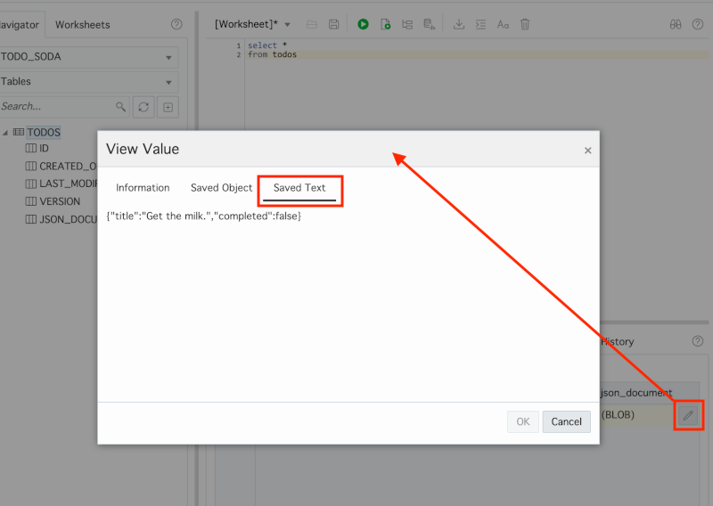

# Module 4: Use SODA APIs for CRUD Operations

In this module, you will extend the Node.js starter application by adding the appropriate SODA API calls and related code. By the end of the module, all of the basic CRUD functionality to work with todos in the todo app will be complete.

Note that the Docker container created in the previous module uses a program to monitor changes you make to the application code on your host operating system. When you update the code and save your changes the app should restart automatically. If the code has an error that prevents the app from starting correctly, then the container may eventually stop running. If this happens, you can restart the container with the following command:

```
docker start -i soda-app-container
```

## Objectives

- Use SODA APIs to create a collection to store todos
- Use SODA APIs for CRUD operations related to todos

## Parts

### **Part 1**: Create a collection to store todos

The terminology used with document stores differs a little from what you might be used to in the relational world. For example, rather than tables that store rows, you work with collections that store documents. In this part, you will create a collection to store todo documents.

With node-oracledb (the Oracle Database driver for Node.js), SODA APIs are exposed via a top level object returned from a synchronous method call on a connection object: `connection.getSodaDatabase()`. Once that object is obtained, a collection can be created via the asynchronous `soda.createCollection()` method.

1.  Open the **database.js** file in the **util** directory.

2.  Locate the `initialize` function and replace the comment related to adding SODA code with code to create a collection named "todos". [Consult the documentation](https://oracle.github.io/node-oracledb/doc/api.html#creatingsodacollections) for details on creating collections. When you save your changes, the app will automatically restart and run the `initialize` function.

    Do your best to write the code on your own, but [use this initialize example](solutions/4/initialize.js) if needed.

3.  To validate your code, you can open SQL Developer Web and log in as the **todo_soda** user. Start by navigating to the Autonomous Database Details page for the **TODODB** instance, then click the **Service Console** button.

    

3.  Click the **Development** menu option on the left, then click **SQL Developer Web**.

    

4.  Change the URL of the login page by replacing **admin** with **todo_soda** (the value passed to the p_url_mapping_pattern parameter in Module 2, Part 2). Then press enter to go to the new URL.

    

    After the page reloads, you may wish to bookmark the URL to make it easier to access if needed.

5.  Set Username to **todo_soda** and Password to **`SecretPassw0rd`**, then click **Sign in**.

    

    Once authenticated, you'll see a table named **TODOS**. This table was created when you created the todos collection.
   
    
   
    As you can see, SODA collections are backed by traditional tables in Oracle Database. In Module 5, you'll see how you can use those tables along with some new SQL functions to work with the JSON data in different ways.

### **Part 2**: Add documents to the collection

With the todos collection in place, you can start to build out the CRUD functionality in the API related to todos. In this part, you will add the ability to add todo documents to the todos collection. [Consult the documentation](https://oracle.github.io/node-oracledb/doc/api.html#-293-creating-and-accessing-soda-documents) for details on adding documents to collections.

1.  Open the **todos.js** file in the **db_apis** directory.

2.  Locate the `create` function and replace the comment related to adding SODA code with code that does the following:
    * Add the `todo` object passed in to the todos collection. Use the method that returns the metadata related to the document.
    * Return the key value associated with the document that was added to the collection.

    Do your best to write the code on your own, but [use this create example](solutions/4/create.js) if needed.

3.  To validate your code, open a browser and navigate to [localhost:3000](http://localhost:3000). Enter some text where it says "What needs to be done?", then press enter. To be sure the todo was saved to the database, return to the TODOS table in SQL Developer Web and ensure you have a new row in the table by running the following query.

    ```
    select *
    from todos
    ```

    You should see the new row under the Query Results tab at the bottom.

    

    If you scroll to the right of the results, you'll see that the json_document column is defined as a BLOB type by default. To see the content with SQL Developer Web, click the "pencil" icon in the field and select the Saved Text tab.

    

### **Part 3**: Fetch documents from the collection

Now that todos are being stored in the collection, the next thing to add is the ability to fetch them back out so they can be displayed in the todo app. As you saw in the previous part, document keys in SODA are stored as separate metadata - not as part of the document content. This is something you'll need to consider when building apps as clients often need the keys to work with REST APIs. [Consult the documentation](https://oracle.github.io/node-oracledb/doc/api.html#-293-creating-and-accessing-soda-documents) for details on adding documents to collections.

1.  Return to the **todos.js** file in the **db_apis** directory.

2.  Locate the `find` function and replace the comment related to adding SODA code with code that does the following:
    * Fetch all of the todo documents from the todos collection.
    * Iterate over the the documents returned and use them to populate the `todos` array which is already declared and returned at the end of the function. Each todo element in the array should have an `id` property with a value that maps to the key of the document.

    Do your best to write the code on your own, but [use this find example](solutions/4/find.js) if needed.

3.  To validate your code, open a browser and navigate to [localhost:3000](http://localhost:3000) or just refresh the page if you're already there. If you see the list of todos populate with the values you previously saved to the collection, then you are successfully fetching the todo documents.

    

### **Part 4**: Update documents in the collection

So far, you've implemented the "C" (create) and the "R" (read) of CRUD operations. In this part, you'll add the "U" - the ability to update existing todo documents. However, the SODA term is replace, not update, since the entire document is replaced. 

The app lets users change the name and status of todos and then issues an HTTP PUT request on the `/todos/:id` API endpoint, passing along the updated todo. [Consult the documentation](https://oracle.github.io/node-oracledb/doc/api.html#-293-creating-and-accessing-soda-documents) for details on replacing documents in collections.

1.  Return to the **todos.js** file in the **db_apis** directory.

2.  Locate the `update` function and replace the comment related to adding SODA code with code that does the following:
    * Use the appropriate SODA API to update the todo in the collection. Use the  method that returns the metadata related to the document.
    * Use the metadata returned from the update to determine if the update was successful. If it was then return true, otherwise (perhaps the key value passed in didn't exist) return false.

    Do your best to write the code on your own, but [use this update example](solutions/4/update.js) if needed.

3.  To validate your code, open a browser and navigate to [localhost:3000](http://localhost:3000) or just refresh the page if you're already there. Either mark the todo as complete or double-click on the name of an existing todo and change it. Then refresh the browser. If you see your changes have persisted across refreshes then the update functionality is working.

### **Part 5**: Remove documents from the collection

All that's left to complete the CRUD functionality is to add the ability to delete todos. The application allows individual todos to be deleted and for all todos marked as "complete" to be deleted at the same time.

1.  Return to the **todos.js** file in the **db_apis** directory.

2.  Locate the `del` function and replace the two comments related to adding SODA code with the appropriate SODA API calls:
    * If a `key` value is passed to the function, then that single document should be removed from the collection.
    * If a `key` value is _not_ passed to the function, then all todos that have a status value of `completed` should be removed from the collection. This will require a simple [Query-by-Example (QBE) filter](https://oracle.github.io/node-oracledb/doc/api.html#sodaqbesearches).

    Do your best to write the code on your own, but [use this del example](solutions/4/del.js) if needed.

3.  To validate your code, open a browser and navigate to [localhost:3000](http://localhost:3000) or just refresh the page if you're already there. Try deleting individual todos and then all of the todos that are marked as complete. Don't forget to refresh the page to ensure that the changes have been made to the database. 

## Summary

This completes Module 4. You now have a working todo tracking application! You created a collection to store todo documents and then updated the API to support basic CRUD operations, all without writing a single line of SQL! Of course, SQL is one of the most powerful and popular programming languages of all time. In the next module, you'll see how some new extensions to the SQL language can help when working with JSON data. [Click here to navigate to Module 5](5-use-sql-features-for-json.md).