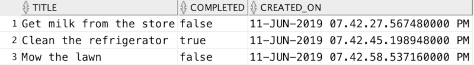
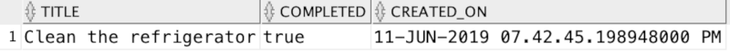

# Module 5: Use SQL Features for JSON

As applications grow, the number of people that need to access and work with the data generated will grow as well. While the Node.js SODA APIs provide an easy way for app developers to start working with JSON data, not everyone will be comfortable working with Node.js or JSON.

In this lab, you will learn to use some of the SQL functions that have been added to Oracle Database to facilitate working with JSON data.

## Objectives

- Use various options to query JSON data
- Use JSON Data Guide to learn about the structure of JSON data

## Required Artifacts

- NA

## Parts

### **Part 1**: Using dot-notation syntax to query JSON data

In this part, you will use dot-notation syntax to query the todo documents. The dot-notation syntax is essentially a table alias, followed by a JSON column name, followed by one or more field names — all separated by periods.

Here's an example query that uses dot-notation syntax to get the Phone property of the ShippingInstructions property of the JSON stored in the PO_DOCUMENT column of the J_PURCHASEORDER table.

```sql
SELECT po.po_document.ShippingInstructions.Phone 
FROM j_purchaseorder po;
```

See [this documentation](https://docs.oracle.com/en/database/oracle/oracle-database/18/adjsn/simple-dot-notation-access-to-json-data.html#GUID-7249417B-A337-4854-8040-192D5CEFD576) for more details on using dot-notation syntax with JSON data.

  - In SQL Developer, open a connection to the database for the TODO_SODA user. 
  - Using a SQL worksheet, write a query using dot notation syntax that returns data from the JSON_DOCUMENT column of the TODOS table in the following format. Note that you may need to create some more todos if you deleted them all in the last lab.
    

    Do your best to write the code on your own, but [use this dot notation example](solutions/dot-notation.sql) if needed.
  - Add a predicate to the previous query so that only "completed" todos are shown:

    

    Do your best to write the code on your own, but [use this dot notation example 2](solutions/dot-notation-2.sql) if needed.

### **Part 2**: Using JSON_TABLE to project JSON relationally

In addition to the dot notation syntax, there are several SQL functions that can be used to query JSON data, including JSON_EXISTS, JSON_VALUE, JSON_QUERY, and JSON_TABLE. JSON_TABLE, which projects JSON data as SQL columns, stands out for performance reasons (it only parses the document column once per row). In this part, you'll use JSON_TABLE to create a relational view over JSON data to simplify queries against it.

You use JSON_TABLE in a SQL FROM clause. It is a row source, meaning it generates a row of virtual-table data for each JSON value selected by a row path expression (row pattern). The columns of each generated row are defined by the column path expressions of the COLUMNS clause. 

Here's an example query that uses JSON_TABLE to project data from the THEATER table, which stores JSON data in the JSON_DOCUMENT column, in a tabular form. Note that an Oracle join is used to join the THEATER table to the JSON_TABLE function, which is passed two parameters. The first parameter is the JSON_DOCUMENT column and the second is a JSON path expression followed by a columns clause which defines how the data should be projected. With JSON path expressions, the dollar sign ($) represents the root of the document.

```sql
select theater_id, name, street, city, zip
from theater,
  json_table(
    json_document, 
    '$' columns (
      theater_id number(4)    path '$.id',
      name       varchar2(16) path '$.name',
      street     varchar2(24) path '$.location.street',
      city       varchar2(32) path '$.location.city',
      state      varchar2(02) path '$.location.state',
      zip        number(5)    path '$.location.zipcode' 
    ) 
  ) 
```

See [this documentation](https://docs.oracle.com/en/database/oracle/oracle-database/18/adjsn/function-JSON_TABLE.html#GUID-0172660F-CE29-4765-BF2C-C405BDE8369A) for more details on using JSON_TABLE.

  - If not already done, open a connection in SQL Developer to the database for the TODO_SODA user.
  - Use the example above as a guide to write a SQL query that uses JSON_TABLE to project data from the JSON_DOCUMENT column of the TODOS table in the following format.

    

    Do your best to write the code on your own, but [use this JSON_TABLE example](solutions/json-table.sql) if needed.
  - Prepend the following code to the JSON_TABLE query and execute the statement. This will create a relational view over the JSON data.
    ```sql
    create or replace view todos_v as
    ```
  - Use the TODOS_V view to query the JSON data as though it were stored as relational data. For example, you could write something like:
    ```sql
    select *
    from todos_v
    ```

### Step 3: Using JSON Data Guide to learn about JSON data

Often times, JSON data comes from third party systems. In these instances, you may be unable to to control the format of the JSON and if the JSON documents are large, they may be fairly difficult to understand. A JSON data guide lets you discover information about the structure and content of JSON documents stored in Oracle Database.

  - If not already done, open a connection in SQL Developer to the database for the TODO_SODA user.
  - Execute the following query in a SQL Worksheet:

    ```sql
      select json_dataguide(json_document)
      from todos
    ```

    If you copy the data out of SQL Developer and format it some, you should see something like the following:

    ```json
    [
      {
        "o:path": "$.title",
        "type": "string",
        "o:length": 32
      },
      {
        "o:path": "$.completed",
        "type": "boolean",
        "o:length": 8
      }
    ]
    ```

    Notice that the JSON_DATAGUIDE function returns metadata in a flattened JSON structure with metadata describing the JSON data. The metadata includes the JSON path expression, data type, and maximum length of the data for each property found. This metadata becomes more useful as JSON becomes more complex.
  - Execute the following query in a SQL Worksheet:

    ```sql
    select json_hierdataguide(json_document)
    from todos
    ```

    You should see output similar instucture (once formatted) to the following:

    ```json
    {
      "type": "object",
      "properties": {
        "title": {
          "type": "string",
          "o:length": 32,
          "o:preferred_column_name": "title"
        },
        "completed": {
          "type": "boolean",
          "o:length": 8,
          "o:preferred_column_name": "completed"
        }
      }
    }
    ```

    As you can see, the JSON_HIERDATAGUIDE returns a nested JSON structure known as JSON schema. This variation of the metadata provided by JSON Data Guide can be useful for applications that work with JSON schema.

## Summary

You have completed the lab, well done! At this point, you should have a basic understanding of how ATP works, how to connect to ATP from SQL Developer Web and Node.js, how to use the SODA APIs for Node.js, and how to use some of the new JSON features of the Oracle Database.

Use these links to get more information and continue learning:

* [Oracle Autonomous Transaction Processing Cloud docs](https://docs.oracle.com/en/cloud/paas/atp-cloud/index.html)
* [Creating a REST API with Node.js and Oracle Database](https://jsao.io/2018/03/creating-a-rest-api-with-node-js-and-oracle-database/)
* [Using Oracle SQL Developer Web](https://docs.oracle.com/en/database/oracle/sql-developer-web/18.1/sdweb/sdw-help.html)
* [Oracle Database JSON Developer's Guide](https://docs.oracle.com/en/database/oracle/oracle-database/19/adjsn/index.html)