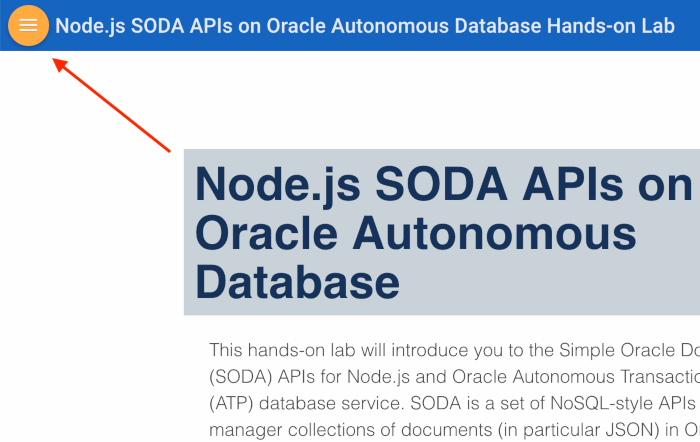
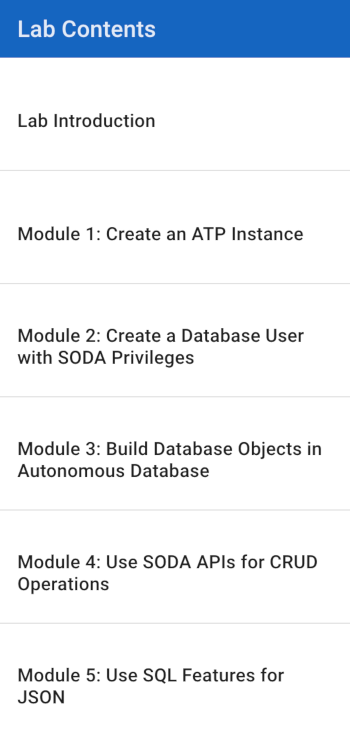

# Node.js SODA APIs on Oracle Autonomous Database

This hands-on lab will introduce you to the Simple Oracle Document Access (SODA) APIs for Node.js and Oracle Autonomous Transaction Processing (ATP) database service. SODA is a set of NoSQL-style APIs that let you manager collections of documents (in particular JSON) in Oracle Database without needing to know Structured Query Language (SQL). ATP delivers a self-driving, self-securing, self-repairing database service that can instantly scale to meet demands of mission critical transaction processing and mixed workload applications. 

You will work to complete a todo tracking application. The front-end app  is based on the [TodoMVC](http://todomvc.com/) front-end. The mid-tier will be a Node.js based REST API that uses the SODA APIs included with node-oracledb (the database driver for Oracle Database) to work with data. Of course, ATP will be used the application's persistence layer.

## Lab Objectives

* Create an ATP instance
* Securely connect to ATP from SQL Developer Web and Node.js
* Use SODA APIs in Node.js to fetch and persist data in ATP
* Use JSON functions in SQL to work with JSON data

## Modules

| # | Module | Est. Time |
| - | -      | -         |
| 1 | [Create an ATP instance](1-create-an-atp-database.md) | ? min |
| 2 | [Create a DB user with SODA privileges](2-create-db-user-with-soda-privs.md) | ? min |
| 3 | [Clone Git repo and build Docker image](3-clone-git-repo-and-build-docker-image.md) | ? min |
| 4 | [Use SODA APIs for CRUD operations](4-use-soda-apis-for-crud-operations.md) | ? min |
| 5 | [Use SQL features for JSON](5-use-sql-features-for-json.md) | ? min |

## Parts

### **Part 1**: Acquire an Oracle Cloud trial account

1. If you already have an Oracle Cloud trial account (or regular account), you may skip to the next part.

2. Please <a href="https://myservices.us.oraclecloud.com/mycloud/signup?language=en&sourceType=:ow:lp:cpo::RC_NAMK190523P00161:APEX_ATP_HOL&intcmp=:ow:lp:cpo::RC_NAMK190523P00161:APEX_ATP_HOL" target="_trial_">click this link to create your free account</a>. When you complete the registration process you'll receive an account with a $300 credit that will enable you to complete the lab for free. You can then use any remaining credit to continue to explore the Oracle Cloud.

3. Soon after requesting your trial you will receive the following email. Once you receive this email you can proceed to Part 2.

   

### How to Get Your Free Cloud Trial Account
[Click this link](https://myservices.us.oraclecloud.com/mycloud/signup?language=en&sourceType=:ex:tb:::RC_NAMK181011P00041:ATPHOL&SC=:ex:tb:::RC_NAMK181011P00041:ATPHOL&pcode=NAMK181011P00041) and complete all the required steps to get your free Oracle Cloud trial account. When you complete the registration process, you'll receive a $300 credit that will enable you to complete the lab for free. After the lab, you'll be able to use any remaining credits to continue to explore the Oracle Cloud.

### **Part 2**: Navigate to Module 1

1. [Click here](1-create-an-atp-database.md) to navigate to Module 1. Alternatively, you can click the navigation menu icon in the upper-left corner of the browser window to see a list of modules in the lab.

	 

2. Click **Module 1: Create an APEX Workspace**.
  
   